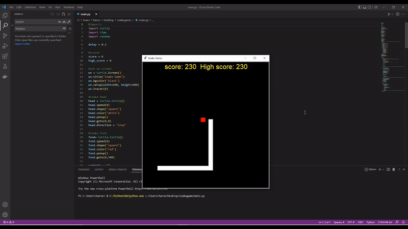

# Snake-game-in-python

There exists a number of ways to create this game and one includes the use of Python’s PyGame library which is a Python library we use to create games.

The other way is by the use of the turtle library. This module comes pre-installed with Python and it provides a virtual canvas for users to create shapes and pictures.

Therefore, this project uses the turtle library to implement a simple snake game which is easier and faster to develop.

